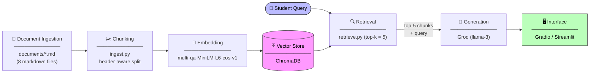

# Project 1 Planning: The Unofficial Guide

> Write this document before you write any pipeline code.
> Your spec and architecture diagram are what you'll use to direct AI tools (Claude, Copilot, etc.) to generate your implementation — the more specific they are, the more useful the generated code will be.
> Update the Retrieval Approach and Chunking Strategy sections if you change your approach during implementation.
> Update this file before starting any stretch features.

---

## Domain

<!-- What domain did you choose? Why is this knowledge valuable and hard to find through official channels? -->

On and Off Campus housing and landlord navigation at Western Michigan University
This knowledge is valuable because:

- Selecting housing is a small choice with year-long consequences due to leasing requirements
- The On-campus official university resources are vague and hard to navigate
- The Off-Campus only showcase polished best-case scenarios
- I had a very bad personal experience finding housing

This RAG should provide a system of clarity aiding in the choice of housing.

---

## Documents

<!-- List your specific sources: URLs, subreddit names, forum threads, or file descriptions.
     Aim for at least 10 sources that together cover different subtopics or perspectives within your domain. -->

| #   | Source                                              | Description                                                                                                              | URL or location                                                           |
| --- | --------------------------------------------------- | ------------------------------------------------------------------------------------------------------------------------ | ------------------------------------------------------------------------- |
| 1   | WMU Housing — Residence Halls                       | 2025–26 and 2026–27 rate tables for all 5 halls; room types, amenities, eligibility per hall                             | wmich.edu/housing/info/rates · wmich.edu/housing/options/halls            |
| 2   | WMU Housing — On-Campus Apartments                  | Monthly rates and full cancellation fee schedule for Arcadia Flats, Western View, Stadium Drive, Spindler                | wmich.edu/housing/apartment-rates · wmich.edu/housing/info/cancelcontract |
| 3   | ApartmentRatings.com / BBB — Landlord Profiles      | Review aggregations and BBB records for Concord Place (Edward Rose), Icon Properties, Nu Partners                        | apartmentratings.com · bbb.org                                            |
| 4   | ApartmentRatings.com — Off-Campus Complexes         | 108–164 student reviews each for The Paddock, 58 West, The Wyatt, and Bronco Club                                        | apartmentratings.com · complex websites                                   |
| 5   | Western Herald — Campus Neighborhood Safety         | Four rental zone profiles; crime stats within 2-mile campus radius; Fraternity Village pedestrian safety                 | westernherald.com · fox17online.com                                       |
| 6   | KMetro + WMU Busing & Parking                       | KMetro routes 3/16/21, Bronco Card free bus pass policy, full WMU parking permit pricing table, winter commuting hazards | wmich.edu/busing · wmich.edu/parking · kmetro.com                         |
| 7   | Michigan Legislature — MCL 554.609 & 554.613        | Security Deposit Act (Act 348): 30-day itemization rule, exact statutory language, 2× penalty                            | legislature.mi.gov (sourced via hemlane.com)                              |
| 8   | EnergySage / Numbeo / RentCafe — Utility Benchmarks | Kalamazoo seasonal utility cost ranges, complex-by-complex utility inclusion matrix, drafty-unit risk factors            | energysage.com · numbeo.com · rentcafe.com                                |

> **Note on data collection:** An initial attempt used `collect_documents.py` (a PRAW-based Reddit scraper targeting r/WMU and r/kzoo) to gather student review data for sources 3–6 and 8. Reddit's API blocked all anonymous and script-level access before any data could be collected. The 8 documents above were compiled instead from official WMU pages, ApartmentRatings.com, review aggregators, and primary legal sources via web research. `collect_documents.py` is preserved in the repo as a record of this attempt.

---

## Chunking Strategy

<!-- How will you split documents into chunks?
     State your chunk size (in tokens or characters), overlap size, and explain why those
     numbers fit the structure of your documents.
     A review-heavy corpus warrants different chunking than a long FAQ. -->

**Chunk size:** One `##` or `###` section per chunk (roughly 200–700 characters each).

**Overlap:** None. Each section covers one topic (one hall, one complex, one legal rule) so there's nothing useful to carry over.

**Reasoning:** The documents are structured markdown — splitting on headers keeps each section intact as a coherent unit. A fixed character split would cut through pricing tables mid-row, making the retrieved chunk meaningless. Header-based splitting keeps tables whole and matches how a student would actually ask a question.

---

## Retrieval Approach

<!-- Which embedding model are you using (e.g., all-MiniLM-L6-v2 via sentence-transformers)?
     How many chunks will you retrieve per query (top-k)?
     If you were deploying this for real users and cost wasn't a constraint, what tradeoffs
     would you weigh in choosing a different embedding model — context length, multilingual
     support, accuracy on domain-specific text, latency? -->

**Embedding model:** `multi-qa-MiniLM-L6-cos-v1` via sentence-transformers. Same size and speed as the commonly used `all-MiniLM-L6-v2`, but fine-tuned on question-answer pairs rather than general sentence similarity — a better fit since every query in this system is a student question and every chunk is a potential answer.

**Top-k:** 5. Enough to cover multi-part questions (e.g., "total cost at The Paddock" needs the rent, utility, and management chunks) without flooding the LLM context with noise from unrelated sections.

**Production tradeoff reflection:** For a real deployment, the main upgrade would be switching to a larger model like `all-mpnet-base-v2` or a domain-fine-tuned model for better accuracy on housing-specific language. A second improvement would be adding MMR (Maximal Marginal Relevance) retrieval — instead of returning the 5 most similar chunks, it alternates between similarity and diversity, preventing 5 near-identical complaint quotes about the same complex from crowding out other relevant sections. At larger scale, hybrid retrieval (BM25 keyword search + semantic search combined) would help with exact-match queries like MCL section numbers or specific complex names where keyword overlap matters as much as semantic meaning.

---

## Evaluation Plan

<!-- List your 5 test questions with their expected correct answers.
     Questions should be specific enough that you can judge whether the system's response
     is right or wrong. "What are good dining halls?" is too vague.
     "What do students say about wait times at [dining hall name] during lunch?" is testable. -->

| #   | Question                                       | Expected answer                             |
| --- | ---------------------------------------------- | ------------------------------------------- |
| 1   | Which is cheaper, On-campus or Off-campus?     | Off-campus                                  |
| 2   | What is the closest Off-Campus housing option? | The Tate                                    |
| 3   | How is Off-campus transportation?              | Should mention that it's free for stutdents |
| 4   | Does hunter's ridge include utilities in rent? | Yes, except electric bill                   |
| 5   | What is the most dangerous place to rent in?   | Near downtown                               |

---

## Anticipated Challenges

<!-- What could go wrong? Name at least two specific risks with reasoning.
     Consider: noisy or inconsistent documents, missing source attribution, off-topic
     retrieval, chunks that split key information across boundaries. -->

1. I made AI scrape the data, while the general information is correct, integrity is still questionable, I had to manually verify some.

2. By design, this won't reason and answer general questions such as, "Which off-campus apartment complex offers the best price to benefit?"

---

## Architecture

<!-- Draw a diagram of your pipeline showing the five stages:
     Document Ingestion → Chunking → Embedding + Vector Store → Retrieval → Generation
     Label each stage with the tool or library you're using.
     You can use ASCII art, a Mermaid diagram, or embed a sketch as an image.
     You'll use this diagram as context when prompting AI tools to implement each stage. -->

---

## AI Tool Plan

<!-- For each part of the pipeline below, describe:
     - Which AI tool you plan to use (Claude, Copilot, ChatGPT, etc.)
     - What you'll give it as input (which sections of this planning.md, which requirements)
     - What you expect it to produce
     - How you'll verify the output matches your spec

     "I'll use AI to help me code" is not a plan.
     "I'll give Claude my Chunking Strategy section and ask it to implement chunk_text()
     with my specified chunk size and overlap" is a plan. -->

When navigating decisions I'm not an expert in, I usually prompt AI to research the current theoretical approaches then use [Decision Council](https://github.com/gcpdev/llm-council-skill) skill by supplying it said information and current project requirements, then re-iterate through discussion and critical thinking

Once I have a theoretical solution I'm satisfied with I commit the architectural plan in a separate implementation markdown file, compact the conversation then use [https://github.com/obra/superpowers] skills to Plan; Write tests; Implement; Review the implementation.

Each step of the milestone will have it's own spec markdown.

### **Milestone 3 — Ingestion and chunking:**

### **Milestone 4 — Embedding and retrieval:**

### **Milestone 5 — Generation and interface:**
